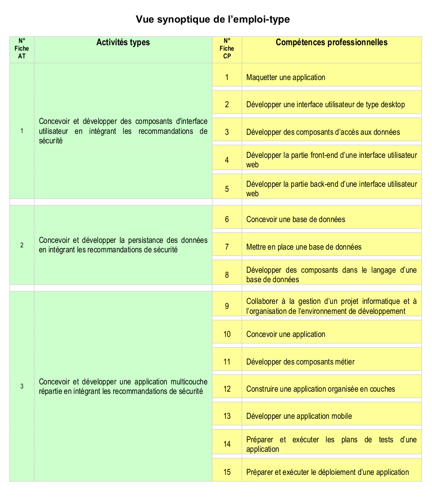

# Dossier-projet

---

> ### Table des matières
>
> - resume de projet/
>
>   - 📄 [resume](./resume-projet/resume.md)
>
> - specification fonctionnelles/
>
>   - cahier des charges/
>
>     - 📄 [analyse-des-besoins](./specification-fonctionnelles/cahier-des-charges/analyse-des-besoins.md)
>     - 📄 [composition-equipe](./specification-fonctionnelles/cahier-des-charges/composition-equipe.md)
>     - 📄 [contexte-et-enjeux](./specification-fonctionnelles/cahier-des-charges/contexte-et-enjeux.md)
>     - 📄 [personnas](./specification-fonctionnelles/cahier-des-charges/personnas.md)
>
>   - 📄 [methodologie](./specification-fonctionnelles/methodologie.md)
>
>   - 📄 [RBAC](./specification-fonctionnelles/RBAC.md)
>   - 📄 [regles-gestion](./specification-fonctionnelles/regles-gestion.md)
>
> - specification techniques/
>
>   - api/
>
>     - 📄 [choix-stack](./specification-techniques/api/choix-stack-API.md)
>     - 📄 [strategie-securisation-API](./specification-techniques/api/strategie-securisation-API.md)
>
>   - Base de Données/
>     - [choix-BDD](./specification-techniques/base-de-donnee/choix-BDD.md)
>     - [strategie-securisation-BDD](./specification-techniques/base-de-donnee/strategie-securisation-BDD.md)

---

## Liste de compétences du référentiel

---
