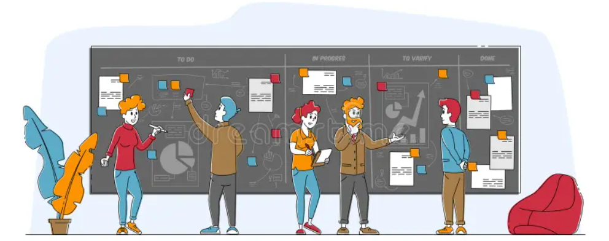

# Méthodologie et plannification

Ce document décrit notre approche et organisation pour le projet Discord Communautaire de Simplon HDF. Pour rendre nos choix transparents et compréhensibles, nous avons illustré notre sélection de méthodologies et d'outils de gestion de projet à travers des tableaux comparatifs. Ces tableaux démontrent comment chaque option se conforme aux exigences spécifiques du projet, assurant une progression efficace et adaptée. 

Notre but est de présenter de manière claire et structurée le plan de travail et l'organisation adoptée pour atteindre nos objectifs de manière efficiente.

## <u>Rôles et Responsabilités de l'Équipe</u>

Chaque membre de l'équipe a des rôles et responsabilités spécifiques pour assurer le bon déroulement du projet :

- <u>**Product Owner** :</u> Responsable de définir et de prioriser les fonctionnalités du Product Backlog.\
➡️ Assigné à : Saif ALI

- <u>**Scrum Master** :</u> Facilite les rituels SCRUM, élimine les obstacles et aide l'équipe à améliorer son processus de travail.\
➡️ Assigné à : Cécie HURAIUX

- <u>**Équipe de Développement** :</u> Développe les fonctionnalités définies dans le Sprint Backlog et collabore pour atteindre les objectifs du sprint.
➡️ Assigné à : Cécile HURIAUX & Saif ALI

## <u>Méthodologie de Travail</u>

- ### Tableau Comparatif des Méthodologies de Travail

Ce tableau présente une comparaison des avantages et des inconvénients de différentes méthodologies de développement logiciel, permettant une analyse détaillée selon des critères spécifiques.

| Critères                         | SCRUM                               | Agile                               | KANBAN                              | SAFe                                | Waterfall                           |
|----------------------------------|-------------------------------------|-------------------------------------|-------------------------------------|-------------------------------------|-------------------------------------|
| **Flexibilité**                  | 🟢 Très adaptable aux changements    | 🟢 Maximise l'adaptabilité          | 🟢 Ajustements basés sur le travail actuel | 🟢 Flexible mais complexe            | 🔴 Rigide, suit un plan fixe         |
| **Délai de mise en marché**      | 🟢 Rapide, avec des cycles courts    | 🟢 Très rapide grâce à des livraisons fréquentes | 🟢 Varie selon le travail, souvent rapide | 🟢 Conçu pour être rapide à grande échelle | 🔴 Plus lent, tout est livré à la fin |
| **Gestion des changements**      | 🟢 Facile à gérer à petite échelle   | 🟢 Excellente gestion des ajustements continus | 🟢 Bonne capacité de réaction aux changements | 🟢 Organisée mais peut être complexe  | 🔴 Difficile en fin de projet         |
| **Complexité de mise en œuvre**  | 🔴 Nécessite une certaine formation  | 🔴 Peut être complexe selon l'approche | 🟢 Simple et direct                  | 🔴 Nécessite beaucoup de connaissances spécifiques | 🟢 Simple, plan clair                  |
| **Convient aux grands projets**  | 🟢 Bon avec des adaptations          | 🔴 Dépend de la méthode spécifique   | 🔴 Pas idéal pour les très grands projets | 🟢 Parfait pour les grandes entreprises | 🟢 Bien si les besoins ne changent pas |
| **Documentation**                | 🟢 Importante mais flexible          | 🟢 Peu formelle et adaptable         | 🟢 Très nécessaire pour suivre le travail | 🔴 Très détaillée et fixe             | 🔴 Très détaillée et fixe             |
| **Engagement client**            | 🟢 Très impliqué avec des réunions régulières | 🟢 Collaboration constante avec le client | 🔴 Variable, dépend de la gestion   | 🟢 Fortement engagé avec des rôles clairs | 🔴 Limité, surtout au début           |
| **Tarifs**                       | 🟢 Généralement économique           | 🟢 Coûts modérés, flexible          | 🟢 Peu coûteux, pas de frais supplémentaires | 🔴 Peut être coûteux en raison de sa complexité | 🟢 Economique sauf en cas de retard   |

Pour répondre aux besoins spécifiques du projet 'Serveur Discord Communautaire Simplon' pour Simplon HDF, la combinaison des méthodologies Agile et SCRUM représente une approche stratégique idéale. Ce choix reflète notre engagement à fournir une solution hautement adaptative et bien structurée, répondant aux exigences dynamiques de gestion, de communication, et de sourcing de Simplon.

- ### <u>Agile</u>

**Agile** est idéale pour ce projet car elle nous permet de nous adapter rapidement et efficacement aux changements. Cette méthode favorise une interaction continue avec toutes les parties prenantes, ce qui nous aide à ajuster nos processus en fonction des retours et des évolutions du contexte organisationnel de Simplon. Agile nous donne la flexibilité nécessaire pour répondre aux exigences dynamiques de gestion, de communication et de sourcing.

- ### <u>SCRUM</u>

**SCRUM**, de son côté, apporte une structure organisée à travers des cycles de développement appelés sprints. Chaque sprint(¹) est une opportunité pour évaluer nos avancées et ajuster nos plans. Ce cadre est essentiel pour maintenir l'alignement du projet avec ses objectifs, surtout dans un contexte où plusieurs acteurs et des exigences variées sont impliqués. SCRUM est particulièrement adapté pour optimiser la satisfaction des utilisateurs grâce à ses revues régulières et une transparence accrue.

- ### <u>Combinaison Agile/SCRUM</u>

Ainsi, la combinaison de **Agile et SCRUM** offre le meilleur équilibre entre adaptation rapide et maintien d'un cadre opérationnel rigoureux. On s'assure ainsi que le projet progresse de manière itérative et réactive, tout en garantissant une gestion structurée et coordonnée de toutes les activités de développement. Cela nous permet de répondre aux besoins de Simplon HDF avec précision tout en préparant le terrain pour des améliorations futures, en fonction des retours des utilisateurs..

## <u>Outils de Gestion de Projet</u>

- ### <u>Tableau Comparatif des Outils</u>

| Critères                         | Trello                              | JIRA                                | Asana                               | Monday.com                          | ClickUp                             |
|----------------------------------|-------------------------------------|-------------------------------------|-------------------------------------|-------------------------------------|-------------------------------------|
| **Facilité d'utilisation**       | 🟢 Très intuitif et simple à utiliser| 🔴 Complexe, riche en fonctionnalités| 🟢 Interface claire et épurée       | 🟢 Visuel et facile à personnaliser | 🟢 Très personnalisable, intuitif    |
| **Intégrations**                 | 🟢 Bonnes intégrations, surtout avec des outils simples | 🟢 Excellentes, surtout avec des outils de développement | 🟢 Bonnes intégrations générales    | 🟢 Excellentes, large éventail      | 🟢 Très bonnes, extrêmement polyvalent |
| **Flexibilité**                  | 🟢 Flexible, mais limité par la simplicité | 🟢 Très flexible pour les méthodes agiles | 🟢 Assez flexible pour différents workflows | 🟢 Très flexible avec automatisations| 🟢 Extrêmement flexible et modulable |
| **Gestion des tâches**           | 🟢 Simple, basé sur des cartes       | 🟢 Très détaillée, gestion fine des tâches| 🟢 Gestion de tâches efficace       | 🟢 Gestion puissante avec beaucoup d'options| 🟢 Complet, avec vues multiples      |
| **Rapports et suivis**           | 🔴 Basique, principalement visuel    | 🟢 Très détaillés, personnalisables  | 🔴 Modérément détaillés             | 🟢 Très bons rapports et analytics  | 🟢 Excellents, personnalisables      |
| **Tarifs**                       | 🟢 Généralement économique           | 🔴 Peut être coûteux                 | 🟢 Coûts modérés, flexible          | 🔴 Peut devenir coûteux             | 🟢 Flexible et généralement abordable|
| **Gestion de projets à grande échelle**| 🔴 Moins idéal pour très grands projets | 🟢 Excellent pour les grands projets| 🔴 Bien pour des projets de taille moyenne | 🟢 Bon pour les grandes équipes      | 🟢 Très adaptable à tous les niveaux|
| **Collaboration**                | 🟢 Bonne, mais basique               | 🟢 Excellente, conçu pour les équipes de devs | 🟢 Très bonne collaboration         | 🟢 Excellente avec beaucoup d'outils collaboratifs | 🟢 Superbe, avec des fonctionnalités dédiées |

Afin d'adhérer parfaitement à l'approche Agile/SCRUM que nous avons adoptée, nous avons estimé que **JIRA** serait particulièrement efficace pour ce projet, car il est spécialement conçu pour supporter les méthodologies de développement agile, parfaites pour gérer des projets technologiques et collaboratifs comme le nôtre. 

JIRA offre des fonctionnalités qui nous aident à visualiser nos progrès, à planifier de manière flexible et à nous adapter aux exigences changeantes du projet. En utilisant JIRA, nous pouvons rester alignés avec les principes Agile tout en bénéficiant d'une structure qui nous aide à livrer efficacement nos logiciels.

De plus, JIRA nous permet de tirer parti des nombreux outils et ressources disponibles pour les équipes Agile, ainsi que du support d'une vaste communauté et de consultants spécialisés.\

## <u>Plannification</u>

- ### <u>Les Sprints</u>

Les sprints sont planifiés sur une durée fixe, généralement de quelques jours à une semaine.

Chaque sprint commence par une réunion de planification (Sprint Planning) et se termine par une revue de sprint (Sprint Review) et une rétrospective (Sprint Retrospective). Entre ces réunions, des Daily Scrum sont tenus quotidiennement pour assurer une communication continue et l'ajustement des tâches.

- ### <u>Les Rituels SCRUM</u>

Après avoir commencé par définir les objectifs du projet, nous utilisons le processus SCRUM pour structurer et organiser notre travail.

Dans ce processus, nous suivons une série d’étapes bien définies qui s'articulent autour du Product Backlog, des sprints, et de l'itération continue pour améliorer et peaufiner le produit. Voici comment ces étapes se déploient :

 - <u>**Product Backlog**</u>\
Au cœur de notre gestion de projet SCRUM, il s'agit de la liste de toutes les fonctionnalités, améliorations, et corrections de bugs que nous envisageons pour le serveur Discord. Il est continuellement mis à jour et révisé pour refléter les nouvelles informations et les priorités changeantes du projet.\
Le **Product Owner** gère cette liste, en décidant de l'ordre des priorités et en s'assurant qu'elle reste à jour.

 - <u>**Sprint Planning**</u>\
Lors du Sprint Planning, notre équipe se réunit pour définir les fonctionnalités du **Product Backlog** que nous allons aborder dans les prochaines semaines. Le résultat de cette réunion est une liste de tâches spécifiques et détaillées appelées **Sprint Backlog**. Le but est de définir un Objectif du sprint (**Sprint Goal**) clair qui guidera notre équipe tout au long du sprint.

 - <u>**Daily Scrum**</u>\
Durant le sprint, l'équipe a des réunions quotidiennes de coordination. Ces Daily Scrums servent à synchroniser les activités de l'équipe, identifier les obstacles, et ajuster le plan de travail en conséquence pour rester sur la trajectoire fixée par le **Sprint Goal**.

 - <u>**Sprint Review**</u>\
À la fin du sprint, une Sprint Review est organisée un mercredi sur deux, où notre équipe se réunit avec les clients pour examiner ce qui a été accompli. Durant cette réunion, nous présentons les fonctionnalités et améliorations développées sur le serveur Discord. Cela nous permet de recueillir des retours précieux directement des parties prenantes et de vérifier si le produit développé répond bien à leurs attentes.

 - <u>**Sprint Retrospective**</u>\
Après la review, vient la Sprint Retrospective. Cette réunion est dédiée à l'analyse des processus utilisés pendant le sprint. L'équipe discute de ce qui a bien fonctionné et de ce qui peut être amélioré pour les prochains sprints. C'est un moment essentiel pour l'amélioration continue des pratiques de l'équipe.

## Organisation des Tickets sur JIRA

Pour gérer efficacement le projet SimplOnboarding, nous avons organisé notre travail en plusieurs Epics et tâches et sous-tâches associées sur JIRA. Cette structure nous permet de suivre l'avancement du projet de manière claire et organisée. Voici un aperçu détaillé de notre organisation des tickets sur JIRA.

- ### Epics et Tâches

### 1. 🟪 Mise en Place du Projet
**Objectif :** Préparer notre espace de travail.
- Nous commençons par créer un répertoire Git pour stocker notre code et organisons les fichiers et dossiers nécessaires. Nous rédigeons également les premiers documents de présentation du projet.

### 2. 🟪 Cahier des Charges
**Objectif :** Documenter en détail les aspects du projet.
- Nous produisons des documents pour décrire précisément les besoins du projet, les membres de l'équipe, les défis à surmonter et les utilisateurs cibles.

### 3. 🟪 Gestion de Projet
**Objectif :** Organiser et suivre le projet efficacement.
- Nous créons un document qui explique comment nous allons gérer le projet, les méthodes de travail à suivre et les procédures de suivi des progrès.

### 4. 🟪 RBAC et Règles de Gestion
**Objectif :** Organiser l'accès et les données du projet.
- Nous définissons des rôles et des permissions pour clarifier qui peut accéder et modifier certaines parties du projet. Les règles de gestion aident à expliquer comment les informations doivent être reliées et gérées dans un système pour qu'elles restent correctes et utiles.

### 5. 🟪 Base de données
**Objectif :** Structurer et protéger la base de données.
- Nous mettons en place et sécurisons la structure de la base de données, rédigeons des directives de protection des données (RGPD) et choisissons les technologies appropriées.

### 6. 🟪 Back-end
**Objectif :** Planifier la structure technique du projet.
- Nous utilisons des diagrammes pour définir clairement comment le back-end va fonctionner et pour décider des outils et technologies les plus adaptés à nos besoins.

## Suivi des Tickets

Chaque tâche et sous-tâche est assignée à un membre de l'équipe avec des délais spécifiques pour garantir une progression régulière et contrôlée du projet. Les tickets JIRA nous permettent de suivre l'état de chaque tâche et d'identifier rapidement les obstacles potentiels.

### Statuts des Tickets

Nous avons les statuts suivants pour suivre l'avancement des tickets :

- **À faire**: Tâche à commencer.
- **En cours**: Tâche en cours de réalisation.
- **Problèmes**: Difficulté(s) rencontrées, bugs à corriger.
- **À vérifier**: Tâche terminée en attente de validation du client.
- **Terminé**: Tâche complétée et vérifiée.

### Réunions de Suivi

Des réunions de suivi hebdomadaires sont organisées pour examiner l'avancement des tâches, réassigner les priorités si nécessaire et résoudre les problèmes rencontrés par les membres de l'équipe.

En structurant notre travail de cette manière, nous assurons une gestion claire et efficace du projet, nous permettant de respecter les délais et les exigences de qualité fixées par Simplon.

## <u>Ressources :</u>
#### Tableau Comparatif des Méthodologies de Travail :
- [Asana.com](https://asana.com/fr/resources/waterfall-agile-kanban-scrum)
- [We.Fiit.com](https://www.wefiit.com/blog/scrum-kanban-safe#:~:text=La%20m%C3%A9thode%20SAFe%20repr%C3%A9sente%20une,besoins%20de%20synchronisation%20entre%20elles.)
- [Lucidspark.com](https://lucidspark.com/fr/blog/safe-vs-scrum)

---
#### Tableau Comparatif des Outils de Gestion de Projet :
- [Asana.com](https://asana.com/fr/resources/best-project-management-software)

---
#### SCRUM
- 
- [Visual-Paradigm.com](https://www.visual-paradigm.com/scrum/what-is-product-backlog-in-scrum/)

## <u>Glossaire :</u>

Backlog - Liste de toutes les tâches ou fonctionnalités prévues pour un projet, souvent utilisée dans les contextes Agile et SCRUM.

Sprint - Période définie pendant laquelle une quantité spécifique de travail doit être complétée et prête pour la révision dans un projet Agile.

RBAC (Role-Based Access Control) - Contrôle d'accès basé sur les rôles où les permissions sont attribuées selon les rôles des utilisateurs dans l'organisation.

RGPD (Règlement Général sur la Protection des Données) - Réglementation de l'UE qui dicte comment les données personnelles doivent être traitées et protégées.

Epics - Un groupe de tâches liées qui ensemble contribuent à un objectif plus large dans le cadre de la gestion de projet Agile.

Tâches - Activités ou actions spécifiques qui doivent être complétées dans le cadre d'un projet.

    

